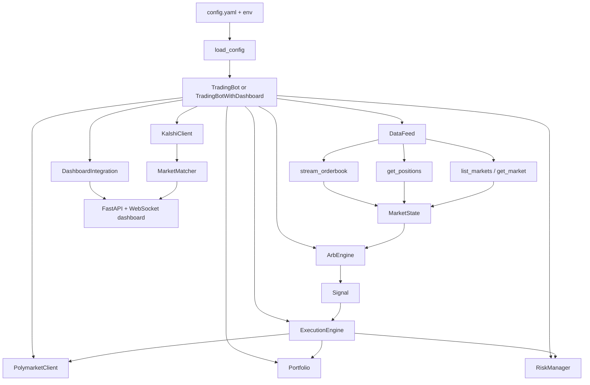
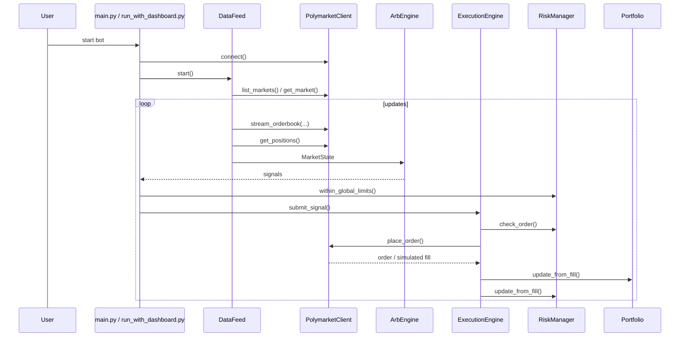

# Polymarket Arbitrage Bot

An async Python trading bot for Polymarket binary markets with:

- Polymarket market discovery and order book polling
- Bundle arbitrage detection (`YES + NO` mispricing)
- Optional market-making signals
- Risk management, execution, and portfolio tracking
- A FastAPI + WebSocket dashboard
- Optional Kalshi market loading and text-based market matching
- Dry-run simulation and backtesting modes

Important: the repository contains cross-platform matching and cross-platform arbitrage logic, but it does **not** currently wire automated Polymarket <-> Kalshi execution into the live bot loop.

## Current Scope
This repo currently supports these capabilities:

| Capability | Status | Notes |
| --- | --- | --- |
| Polymarket US market discovery | Implemented | Uses `gateway.polymarket.us` public endpoints |
| Polymarket US order book ingestion | Implemented | WebSocket-first with REST polling fallback |
| Bundle arbitrage detection | Implemented | `core/arb_engine.py` |
| Market-making signal generation | Implemented | `core/arb_engine.py` |
| Risk checks and kill switch | Implemented | `core/risk_manager.py` |
| Execution queue and order timeout handling | Implemented | `core/execution.py` |
| Dry-run order simulation and fill simulation | Implemented | `polymarket_client/api.py`, `main.py` |
| Dashboard API and WebSocket UI | Implemented | `dashboard/server.py` |
| Kalshi market loading | Implemented | `kalshi_client/api.py` |
| Polymarket/Kalshi market matching | Implemented | `core/cross_platform_arb.py` |
| Cross-platform opportunity engine | Implemented in isolation | Logic exists but is not called from the live trading loop |
| Automated Kalshi execution | Not implemented | Kalshi client is read-only market data in this repo |
| Polymarket US WebSocket path | Implemented | Uses signed headers on `/v1/ws/markets` |

## Architecture


## Runtime Flow


## Repository Layout
```text
polymarket-arbitrage/
├── main.py
├── run_with_dashboard.py
├── config.yaml
├── requirements.txt
├── core/
├── polymarket_client/
├── kalshi_client/
├── dashboard/
├── utils/
├── tests/
├── test_connection.py
└── test_real_data.py
```

## Quick Start
### 1. Install
```bash
python3 -m venv .venv
source .venv/bin/activate
pip install -r requirements.txt
```

### 2. Review `config.yaml`
Recommended safe starting point:

```yaml
mode:
  trading_mode: "dry_run"
  data_mode: "simulation"

trading:
  bundle_arb_enabled: true
  mm_enabled: false

risk:
  max_position_per_market: 15
  max_global_exposure: 50
  max_daily_loss: 10
```

For full observation mode (dashboard + real market data + auto-discovery), use:

```bash
python run_with_dashboard.py -c config.observation.yaml
```

Optional Redis warm cache (disabled by default):

```yaml
cache:
  enabled: true
  backend: "redis"
  redis_url: "redis://localhost:6379/0"
```

### 3. Run
Bot only:

```bash
python main.py
```

Bot plus dashboard:

```bash
python run_with_dashboard.py
```

Dashboard default URL:

```text
http://localhost:8888
```

Useful flags:

```bash
python main.py --dry-run
python main.py --live
python main.py --backtest --backtest-duration 300
python run_with_dashboard.py --port 8888 --host 127.0.0.1
python main.py -c config.yaml -v
```

## Modes
### Trading mode
- `dry_run`: orders and fills are simulated in memory
- `live`: requires credentials and uses the repo's current live API implementation

### Data mode
- `real`: polls live Polymarket market/order book endpoints
- `simulation`: generates synthetic books with deliberate inefficiencies

## Configuration Notes
Credentials can be supplied in `config.yaml` or via environment variables:

```bash
export POLYMARKET_KEY_ID="..."
export POLYMARKET_SECRET_KEY="..."
```

`load_config()` now auto-loads a local `.env` file if present, so you can keep
secrets there without exporting each session.

For live polymarket.us trading, use `POLYMARKET_KEY_ID` and `POLYMARKET_SECRET_KEY` created in the developer portal:

```bash
python create_polymarket_api_creds.py
```

Important implementation notes:

- `api.use_websocket` enables signed market WebSocket subscriptions (`/v1/ws/markets`)
- `api.use_rest_fallback` enables automatic polling fallback if websocket streaming fails
- fee modeling uses the published polymarket.us formula `theta * contracts * p * (1 - p)`
- `monitoring.heartbeat_interval` is defined but not used in the runtime loop
- real-data feed tuning now comes from `monitoring.orderbook_*` fields (batch size, concurrency, and rotation delays)
- dashboard payload size is intentionally capped for `/ws` and `/api/state`; use `/api/markets` for full market snapshots
- optional Redis cache can warm-start Polymarket discovery and cross-platform market matching; if Redis is unavailable, runtime falls back safely to existing in-memory/API behavior

## Dashboard
The dashboard exposes:

- `/`
- `/api/state`
- `/api/markets`
- `/api/opportunities`
- `/api/portfolio`
- `/api/risk`
- `/api/timing`
- `/ws`

The dashboard shows market state, opportunities, signals, trades, risk, portfolio summaries, and cross-platform matching progress.

## Cross-Platform Status
This repo includes:

- a Kalshi market data client
- a market matcher between Polymarket and Kalshi
- a cross-platform arbitrage calculator
- dashboard state for matching progress and matched pairs

What is **not** currently wired end-to-end:

- live cross-platform opportunity generation inside `_on_market_update`
- Kalshi order execution
- automated Polymarket <-> Kalshi hedged execution

## Testing
Unit tests:

```bash
pytest tests -v
```

Manual smoke checks:

```bash
python test_real_data.py
python test_connection.py -c config.yaml
python test_connection.py -c config.observation.yaml
```

## Documentation
Detailed docs live in `docs/`:

- `docs/README.md`
- `docs/ai-repo-map.md`
- `docs/architecture.md`
- `docs/features/trading-bot.md`
- `docs/features/polymarket-data-feed.md`
- `docs/features/strategies.md`
- `docs/features/execution-risk-portfolio.md`
- `docs/features/dashboard.md`
- `docs/features/cross-platform.md`
- `docs/features/configuration-backtesting-and-tests.md`
- `docs/features/redis-cache.md`

## Known Limitations
- WebSocket ingestion uses signed `polymarket.us` streams with REST fallback; under repeated WS failures, effective update cadence falls back to polling speed.
- The adapter uses tolerant response parsing to support SDK/raw API fallbacks, so some newly-added endpoint fields may not be surfaced yet in internal models.
- Cross-platform matching is operational for discovery and dashboard display, but cross-platform trading is not wired into the execution loop.
- Some config keys are documented in code/config but not fully consumed by the entrypoints.

## Safety
- Start with `dry_run`
- Prefer `simulation` when testing the full loop
- Review the risk limits before enabling `live`
- Treat this repository as experimental trading software

