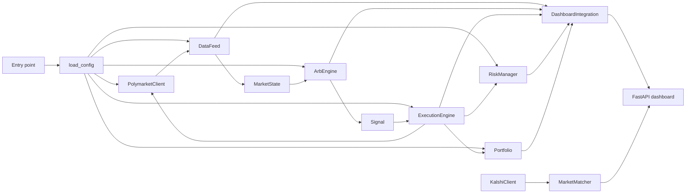
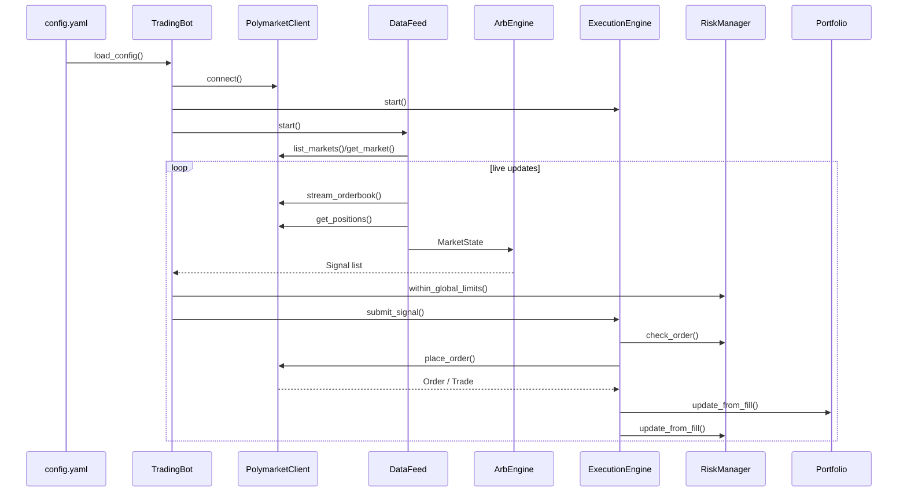

# Architecture

## Overview
The repository is organized around a small set of runtime components:

- an entrypoint (`main.py` or `run_with_dashboard.py`)
- a Polymarket client
- a data feed
- strategy logic
- execution
- risk and portfolio state
- an optional dashboard
- an optional Kalshi-side market discovery and matching path

## Core Component Diagram

## Entrypoints
### `main.py`
`TradingBot` is the simplest production path. It:

1. loads configuration
2. creates the Polymarket client
3. creates portfolio, risk, execution, and arb components
4. starts the data feed
5. reacts to feed updates with `_on_market_update()`
6. optionally simulates fills in dry run
7. logs periodic portfolio/risk snapshots

### `run_with_dashboard.py`
`TradingBotWithDashboard` extends the same flow with:

- `DashboardIntegration`
- `uvicorn` server startup
- optional Kalshi market loading
- background market matching between Polymarket and Kalshi

## Data Flow
### Polymarket-only path

### Dashboard and Kalshi path
The dashboard bot starts the same Polymarket loop, then also:

1. creates `DashboardIntegration`
2. starts the FastAPI app
3. loads open Kalshi markets
4. waits for some Polymarket markets to exist
5. runs `MarketMatcher.find_matches()` in a thread-backed background task
6. publishes matching progress and matched pairs into `dashboard_state.cross_platform`

At present, this path does not turn matched pairs into live cross-platform trades.

## Directory Responsibilities
| Directory | Responsibility |
| --- | --- |
| `core/` | trading logic, execution logic, risk, portfolio, cross-platform helpers |
| `polymarket_client/` | market data, order books, simulated/live order interfaces, shared models |
| `kalshi_client/` | Kalshi market data and order book conversion |
| `dashboard/` | server, dashboard state, UI bridge |
| `utils/` | config parsing, logging, backtest support |
| `tests/` | unit tests for core engine pieces |

## Main State Objects
### `MarketState`
Built in `core/data_feed.py`, consumed in `core/arb_engine.py`.

Contains:

- `market`
- `order_book`
- `positions`
- `open_orders`
- `timestamp`

### `dashboard_state`
Defined in `dashboard/server.py`.

Holds:

- market snapshots
- opportunities
- signals
- open orders
- recent trades
- portfolio and risk summaries
- operational stats
- timing stats
- cross-platform matching state

## Execution Model
`ExecutionEngine` uses an async queue:

1. `submit_signal()` adds signals to `_signal_queue`
2. `_process_signals()` dequeues and routes to placement/cancellation handlers
3. orders are tracked in `_open_orders`
4. `_monitor_order_timeouts()` cancels stale orders
5. `handle_fill()` updates both `Portfolio` and `RiskManager`

This keeps strategy generation and order execution loosely coupled.

## Simulation Model
Two different simulation paths exist:

### Data simulation
`PolymarketClient.stream_orderbook(..., use_simulation=True)` generates synthetic books with occasional inefficiencies.

### Fill simulation
`main.py` and `run_with_dashboard.py` optionally call `client.simulate_fill(order_id)` for dry-run open orders.

### Backtesting
`utils/backtest.py` contains a separate simulated market engine used by `main.py --backtest`.

## Architectural Caveats
- The data feed docstring mentions WebSocket subscription, but the active Polymarket live path is REST polling.
- The dashboard path fully supports market matching progress, but not live cross-platform execution.
- Some config values are defined in `config.yaml` and dataclasses but not forwarded into the runtime components that would use them.
- Live authenticated trading support exists as an interface shape, but parts of the client still contain TODO-style placeholders.

